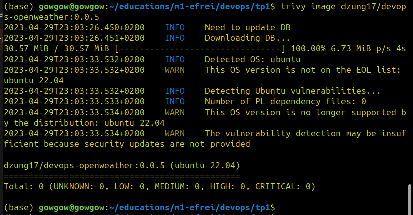
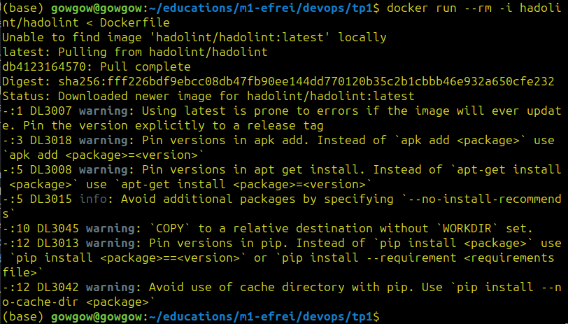

# Rapport TP1

## Les étapes

#### Etape 1 : Créer un wrapper qui retourne la météo d'un lieu donné avec sa latitude et sa longitude (passées en variable d'environnement) en utilisant openweather API
Le fichier `main.py` contient le code qui fait appel à l'api "https://api.openweathermap.org/data/2.5/weather" avec les paramètres `lat`, `lon` et `appid` :
```
params = {'lat': lat,
          'lon': lon,
          'appid': api_key}
response = requests.get(url=api_endpoint, params=params)

```
Si la requête est échouée, le code renvoie l'information sur l'erreur et termine le processus.

#### Etape 2 : Tester le fonctionnement du wrapper 
Pour tester le fonctionnement du wrapper avant de le packager dans l'image Docker, je stocke les valeurs de la latitude, la longitude et la clé d'API dans un ficher .env puis les appeler par :
```
lat = os.getenv('LAT')
lon = os.getenv('LON')
api_key = os.getenv('API_KEY')
```

#### Etape 3 : Créer `Dockerfile`
Dockerfile est utilisé pour créer une image Docker qui peut faire tourner le `main.py`. Voici l'explication de chaque ligne du `Dockerfile` :


```
FROM ubuntu:latest
```
L'image de base pour notre image Docker est la dernière version d'Ubuntu.


```
RUN apt-get update && \
    DEBIAN_FRONTEND=noninteractive apt-get upgrade -yq && \
    apt-get install -y python3 python3-pip && \
    rm -rf /var/lib/apt/lists/*
```
Mettre à jour les packages, installer python3 et pip et enlever les fichiers non nécessaires.


```
COPY main.py .
```
Copier le `main.py` local vers l'image Docker.


```
RUN pip3 install --trusted-host pypi.python.org requests
```
Installer les packages necessaires pour le wrapper.


```
CMD ["python3", "main.py"]
```
La commande à défaut à exécuter lorsque le container commence à tourner est d'exécuter le `main.py` avec python3.

#### Etape 4 : Build l'image
```
docker build -t <registry-name>/<image-name>:<tag-name> .
```
Ici nous utilisons :
```
docker build -t dzung17/devops-openweather:0.0.5 .
```

#### Etape 5 : Push l'image
```
docker push dzung17/devops-openweather:0.0.5
```

#### Etape 6 : Run l'image
```
docker run --env LAT="<your-latitude>" --env LON="<your-longitude>" --env API_KEY=<your-api-key> dzung17/devops-openweather:0.0.5
```

## Bonus

#### Bonus 1 : 0 CVE avec trivy


#### Bonus 2 : Aucune données sensibles stockées dans l'image.
Openweather API est stocké dans une variable d'environnment et est appelé par `--env` option.

#### Bonus 3 : 0 erreur lint sur Dockerfile
