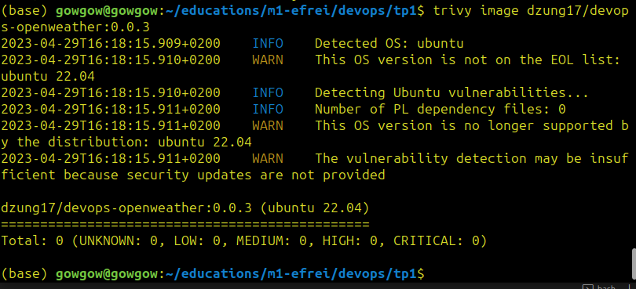

# Rapport TP1

## Les etapes

#### Etape 1 : Créer un wrapper qui retourne la météo d'un lieu donné avec sa latitude et sa longitude (passées en variable d'environnement) en utilisant openweather API
Le fichier `main.py` contient le code qui fait appel a l'api "https://api.openweathermap.org/data/2.5/weather" avec les parametres `lat`, `lon` et `appid` :
```
params = {'lat': lat,
          'lon': lon,
          'appid': api_key}
response = requests.get(url=api_endpoint, params=params)

```
Si la requete est echouee, le code renvoie l'information sur l'erreur et termine le processus.

#### Etape 2 : Tester le fonctionnement du wrapper 
Pour tester le fonctionnement du wrapper, je stocke les valeurs de la latitude, la longitude et la cle d'API dans un ficher .env puis les appeler par :
```
lat = os.getenv('LAT')
lon = os.getenv('LON')
api_key = os.getenv('API_KEY')
```

#### Etape 3 : Creer le `Dockerfile`
Le Dockerfile est utilise pour creer une image Docker qui peut faire tourner le `main.py`. Voici l'explication de chaque ligne :


```
FROM ubuntu:latest
```
L'image de base pour notre image Docker est la derniere version d'Ubuntu.


```
RUN apk --no-cache add hadolint
```
Installer Hadolint dans l'image.


```
RUN apt-get update && \
    DEBIAN_FRONTEND=noninteractive apt-get upgrade -yq && \
    apt-get install -y python3 python3-pip && \
    rm -rf /var/lib/apt/lists/*
```
Mettre a jour les packages, installer python3 et pip et enlever les fichiers non necessaires.


```
COPY main.py .
```
Copier le `main.py` local vers l'image Docker.


```
CMD ["python3", "main.py"]
```
La commande a defaut a executer lorsque le container commence a tourner est d'executer le `main.py` avec python3.

#### Etape 4 : Build l'image
```
docker build -t <registry-name>/<image-name>:<tag-name> .
```
Ici nous utilisons :
```
docker build -t dzung17/devops-openweather:0.0.3 .
```

#### Etape 5 : Push l'image
```
docker push dzung17/devops-openweather:0.0.3
```

#### Etape 6 : Run l'image
```
docker run --env LAT="<your-latitude>" --env LON="<your-longitude>" --env API_KEY=<your-api-key> dzung17/devops-openweather:0.0.3
```

## Bonus

#### Bonus 1 : 0 CVE avec trivy


#### Bonus 2 : 0 erreur lint sur Dockerfile


#### Bonus 3 : Aucune donnee sensible stockee dans l'image.